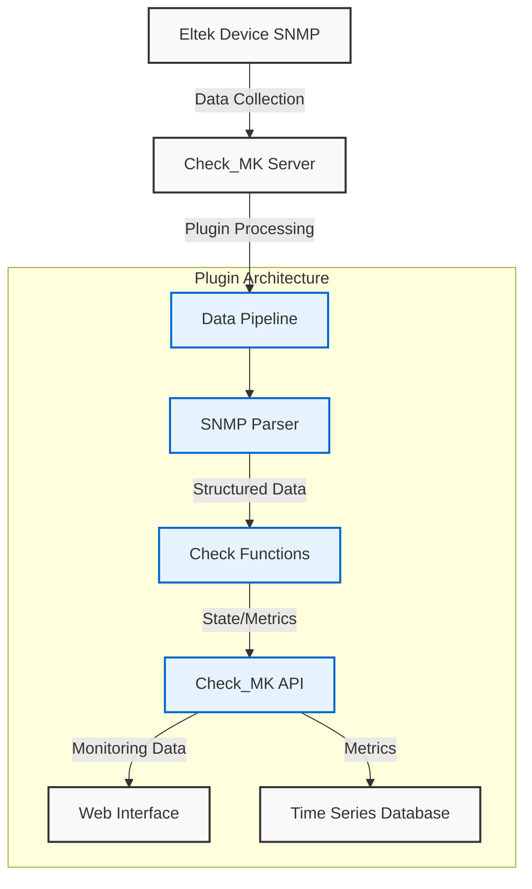

# Technical Architecture

## Core Components

### 1. SNMP Parser
- Processes raw SNMP data from devices
- Converts OID values to structured format
- Handles value normalization and error checking

### 2. Check Functions
- Implements monitoring logic for:
  - System status evaluation
  - Threshold comparisons
  - State mapping (OK/WARN/CRIT)
- Generates metrics for performance analysis

### 3. Check_MK API Integration
- Registers monitoring services
- Formats output for Check_MK web interface
- Provides metric metadata for Grafana

## Data Flow
1. SNMP poller collects raw device metrics
2. Parser converts to structured JSON format
3. Check functions apply monitoring logic
4. Results sent to Check_MK core via API
5. Metrics stored in time-series database
6. Web interface displays current status
